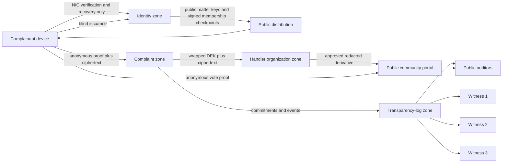

# Threat Model and Privacy/Data-Flow Model

## 1. Method and protected assets

This threat model uses asset/trust-boundary analysis with STRIDE-style categories and privacy-linkability analysis. It treats service operators, administrators, handlers, and network observers as possible adversaries. The most sensitive assets are:

- the hidden relationship between a NIC and a complaint;
- person secret `P`, device secret `D`, recovery seed, mailbox seed, and entitlement token;
- plaintext complaint and evidence;
- handler and witness private keys;
- integrity of membership roots, matter keys, lifecycle history, votes, receipts, and log checkpoints;
- availability of enrollment, recovery, submission, and audit verification.

## 2. Trust zones

No private network route, database credential, administrator role, telemetry stream, or backup account may span the identity and complaint zones.

## 3. Privacy data inventory

| Data | Created/seen by | Stored by | Must not be joined with |
|---|---|---|---|
| NIC and registered contact | IdA | IdA enrollment store | Complaint ID, receipt ID, mailbox ID, entitlement serial |
| `P` | Client | Device and user recovery bundle | NIC outside the user's device |
| `D` | Client | Hardware-backed device storage | Complaint record |
| Membership leaf/index | Client, IdA | IdA | Complaint ID or entitlement serial |
| Issuance fact | IdA | IdA | Blind message or unblinded token |
| Entitlement serial/signature | Client, CS at spend | Client; CS spent-token store | NIC or enrollment record |
| Complaint nullifier | Client, CS | CS | NIC, `P`, membership index |
| Complaint ciphertext | Client, CS, handler | CS/object store | IdA data |
| Complaint plaintext | Client, assigned handler | Handler memory/authorized workspace | IdA data and public log |
| Receipt | Client, CS | Client; minimal CS receipt record | NIC, serial, nullifier, root |
| Mailbox public keys | Client, CS, handler | CS | NIC and entitlement serial |
| Mailbox private seed | Client | User-controlled encrypted bundle | Any server-side record in plaintext |
| Public vote | Community client, portal | Community portal/log | Member identity or membership index |
| Network metadata | Ingress transiently | Short-lived isolated counters | Complaint database |

## 4. Principal adversaries and controls

| Adversary | Capability | Required outcome | Primary controls | Residual risk |
|---|---|---|---|---|
| Malicious IdA | Reads/changes enrollment and issuance data | Cannot read complaints or recognize a spent blind token | Blind RSA issuance, no complaint API, separate zone | Timing and external telemetry correlation |
| Malicious CS | Reads/changes complaint DB and API | Cannot learn NIC or plaintext evidence; modifications detectable | Client encryption, ZK membership, receipts, transparency log | Can refuse service before receipt; traffic observation at ingress |
| IdA and CS collusion | Combines application databases | No deterministic application-data link from complaint to NIC | Blinding, ZK, distinct random values, data minimization | Correlation remains possible using precise timing/device/network side channels |
| Malicious handler | Legitimate access to one case | Cannot browse unrelated cases or identify complainant | Organization-scoped encryption, RBAC/ABAC, WebAuthn, signed access log | Authorized handler can leak plaintext they legitimately see |
| Log operator | Equivocates or rewrites log | Divergence detected | RFC 6962 proofs, three witnesses, 2-of-3 finality, gossip | Two witnesses colluding with operator can finalize a split view |
| Witness compromise | Signs false tree | One compromised witness insufficient | 2-of-3 quorum and independent administration | Two compromised witnesses defeat quorum assumption |
| Phone thief | Controls an unlocked device | Access ends after root update; recovery replaces device | Device unlock, current-root proofs, 30-second updates, recovery rotation | Actions before revocation can be valid and cannot always be undone |
| Recovery thief | Obtains recovery seed | Cannot silently retain access after successful owner recovery | Five-minute challenge, atomic rotation, recovery event logging | Seed theft before rotation enables takeover |
| Network observer | Sees traffic timing/address | Direct complaint-to-person inference is reduced | Optional Tor, batching, no IP persistence, padding policy | Global correlation and device compromise are out of scope |
| Sybil attacker | Creates accounts/devices | One eligible person contributes once per scope | NIC enrollment, one active membership, ZK nullifiers | Registry duplicates/ghost identities transfer into system |
| Community brigade | Coordinates valid voters | Cannot cast multiple votes per person; result not treated as fact | Vote nullifier, quorum, threshold, auditor comparison | Many legitimately eligible coordinated voters can influence signal |
| Malicious uploader | Sends parser exploits/malware | Handler environment remains contained | Allowlist, size limits, quarantine, isolated conversion/scanning | Novel parser exploits; encrypted content prevents CS-side inspection |
| Coercer | Forces user to reveal receipt | Platform cannot confirm identity mapping | No mapping exists; export warning | A user-held signed receipt can be coerced from the user |
| Availability attacker | Floods APIs or storage | Accepted complaints not lost; anonymous users retain access | Queueing, bounded parsing, rate controls, replicas | Strong anonymous rate limits are difficult without linkability |

## 5. Corrected security claims

The system MAY claim:

- no intentional application database contains a NIC-to-complaint mapping;
- a valid proof establishes active membership without disclosing the membership leaf or index;
- a blind entitlement cannot be recognized by the IdA from the final token under the protocol assumptions;
- accepted complaints and later events are tamper-evident after witnessed log inclusion;
- one proof nullifier per person and scope is enforced assuming circuit correctness and `P` secrecy.

The system MUST NOT claim:

- information-theoretic or global-observer anonymity;
- that Tor alone prevents all timing correlation;
- that the log proves a request was never blocked before acceptance;
- that community voting verifies factual truth;
- that commitments prove evidence authenticity;
- that an RSA accumulator is deployed in the prototype;
- that compromise of the user's unlocked device preserves their local privacy.

## 6. Data flows

### 6.1 Enrollment

1. The client generates `P`, `D`, recovery seed/ID, and recovery public key.
2. NIC and registered-channel evidence travel only to the IdA.
3. The IdA validates eligibility, allocates a new leaf index, and stores the leaf/public recovery material.
4. The IdA batches the membership change and publishes a signed checkpoint.
5. The client receives its index/path data and stores secrets locally.

Privacy rule: complaint services do not participate in this flow.

### 6.2 Blind entitlement issuance

1. The client creates a random serial and `personCommitment = Poseidon(domain, P, r)`.
2. It encodes the entitlement message, applies randomized preparation, and blinds the RSA representative.
3. The IdA verifies that this NIC has no issuance record for the matter version.
4. The IdA atomically records the issuance fact and signs the blinded value.
5. The client unblinds and verifies the entitlement.

Privacy rule: the IdA never receives the final encoded message, serial, commitment, or signature.

### 6.3 Submission

1. The client sanitizes public derivatives, builds the manifest, and calculates the salted commitment.
2. It encrypts the complaint package with AES-256-GCM and HPKE-wraps the data key to the handler organization.
3. It obtains a signed challenge/root lease and generates the Groth16 proof against that root.
4. Through Tor or direct TLS, it sends entitlement, proof envelope, ciphertext, wrapped key, mailbox public data, and public commitment.
5. The CS verifies matter/window/key, challenge, lease, RSA signature, proof artifact, public inputs, unused serial, and unused nullifier.
6. In one transaction, the CS consumes the serial/nullifier, stores ciphertext, appends the initial event, and creates the signed receipt.
7. The client later obtains and verifies inclusion in a 2-of-3 witnessed checkpoint.

Privacy rule: the receipt excludes serial, nullifier, membership root, and person commitment.

### 6.4 Device-loss recovery

1. A replacement device obtains a five-minute challenge using the random recovery ID.
2. The user supplies the recovery seed locally; the device derives the recovery signing key and decrypts the local/user-controlled backup of `P`.
3. The replacement device generates new `D` and recovery credentials, then signs the challenge and new public material.
4. The IdA atomically marks the old leaf empty, allocates a fresh index, stores the new recovery public key, and invalidates the old recovery record.
5. The next membership checkpoint makes old-device proofs invalid.

Privacy rule: the recovery request contains no complaint, entitlement, receipt, or mailbox identifier.

### 6.5 Follow-up

1. The client authenticates to its random mailbox by signing a one-time challenge with the mailbox Ed25519 key.
2. Handler replies are HPKE-encrypted to the mailbox X25519 key.
3. Client replies are encrypted to the handler organization and signed by the mailbox authentication key.
4. The CS routes ciphertext but has no mailbox private key.

### 6.6 Public redaction and voting

1. The handler creates a redacted derivative; automated PII checks and an independent reviewer approve it.
2. The portal publishes the derivative, its commitment, provenance, and consent state.
3. An active member obtains a current-root lease, produces a vote proof and nullifier, and submits one of four choices.
4. The portal publishes aggregate results only after the seven-day window and quorum rules.
5. The auditor compares the community assessment with handler findings and logs any escalation or public freeze.

## 7. Linkability analysis

| Pair | Intended relationship | Mitigation |
|---|---|---|
| Enrollment ↔ complaint | Unlinkable | Blind token, ZK membership, no shared IDs, separate zones |
| Two complaints by same person for different matters | Unlinkable | Matter-scoped nullifiers and fresh serials/commitments |
| Complaint ↔ vote by same person | Unlinkable | Different domain/nullifier scopes and separate circuits |
| Complaint ↔ its follow-up mailbox | Intentionally linkable inside the case | Random mailbox ID; no identity or cross-case key reuse |
| Old device ↔ replacement device | Linkable to IdA | Required for revocation; must not leave identity zone |
| Public summary ↔ private complaint | Intentionally verifiable | Explicit derivative commitment/provenance; no raw evidence |

## 8. Abuse and incident rules

- Do not log proof witnesses, decrypted payloads, recovery seeds, or cryptographic private values.
- Authentication failures exposed to unauthenticated callers use uniform error categories and bounded timing.
- A suspected circuit bug, matter-key compromise, membership-checkpoint signing compromise, or two-witness inconsistency is a stop-issuance/stop-acceptance incident for the affected scope.
- A handler encryption-key compromise pauses new assignment to that key, publishes a signed key-status event, rotates the key, and rewraps affected data keys where possible.
- A public-content safety issue may freeze visibility but must not erase the private case or transparency history.
- Security telemetry must be content-free and must not create a durable identifier joinable to complaints.

## 9. Privacy verification checklist

- Database snapshots from IdA and CS contain no common stable identifier capable of deterministic joining.
- Ingress logs cannot be joined to complaint rows by exact timestamp; timestamp precision and retention are minimized.
- Analytics, crash reporting, push notifications, and CDN logs are disabled or privacy-reviewed before use.
- Error reporting redacts CBOR payloads, proofs, ciphertext metadata, and mailbox identifiers.
- Backups preserve zone separation and use independent credentials and encryption keys.
- Public log schemas are allowlisted; unknown fields are rejected rather than accidentally published.
