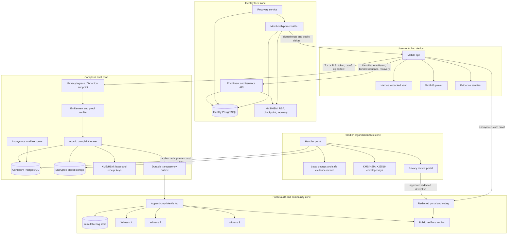
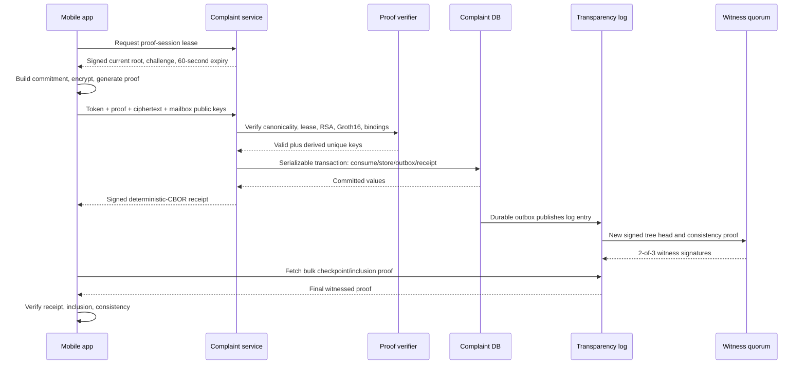

# Service Architecture

## 1. Architectural style

The prototype uses separately deployable containers organized by trust zone, not a single process and not a large production microservice estate. Separation is driven by privacy boundaries: identity services must not share storage, credentials, or telemetry with complaint services. Docker Compose is the initial runtime; production can map the same boundaries to Kubernetes or isolated virtual machines after operational review.

The reference diagram is also available as `diagrams/service-architecture.mmd`.



## 2. Component responsibilities

### Mobile app

- Generates and protects `P`, `D`, recovery and mailbox secrets.
- Performs CBOR encoding, commitment calculation, RSA blind protocol, evidence preprocessing, Groth16 proving, encryption, receipt verification, and log-proof verification.
- Maintains a local copy of public membership deltas sufficient to construct a Merkle path without asking the IdA for a complaint-specific lookup.
- Supports direct TLS and Tor/Orbot-style routing; clearly identifies which mode is active.
- Exports an encrypted recovery bundle only after warning the user about loss/coercion implications.

### Enrollment and issuance API

- Owns NIC eligibility integration and identified device sessions.
- Stores person anchor/device hash, issuance facts, and recovery public state.
- Performs blind RSA signing only after the unique issuance row is secured.
- Has no network route to complaint storage and no complaint-oriented endpoint.

### Membership tree builder

- Serializes leaf allocation/revocation.
- Applies pending changes every 30 seconds if any exist.
- Produces a signed checkpoint and public delta package.
- Sends the checkpoint hash to the transparency outbox without identity data.

### Privacy ingress

- Terminates public/Tor traffic with strict request-size and time limits.
- Removes or isolates network identifiers before forwarding.
- Uses coarse, short-lived abuse counters that cannot be joined to complaint IDs.
- Does not perform content analytics or inject third-party scripts.

### Proof verifier

- Holds an allowlist mapping artifact IDs to immutable verification keys and public-input layouts.
- Verifies leases, RSA entitlements, Groth16 proofs, and canonicality.
- Is stateless with respect to identity and cannot query IdA enrollment records.

### Atomic intake

- Performs the serializable consume/store/log-outbox/receipt transaction.
- Encrypts no user plaintext because ciphertext arrives from the client.
- Signs receipts only from committed database values.
- Returns uniform public errors.

### Handler portal

- Requires WebAuthn and authorization to the assigned organization/case.
- Retrieves ciphertext and invokes organization-controlled KMS/HSM unwrap.
- Opens originals only in a sandboxed safe viewer; normal UI uses sanitized derivatives.
- Signs all accesses, transitions, exports, redactions, and transfers.

### Transparency log and witnesses

- Log accepts allowlisted canonical public events from durable outboxes.
- It builds RFC 6962-style trees and signs tree heads.
- Each witness independently downloads leaves, verifies the previous consistency proof, rebuilds the root, and signs the exact head.
- The public verifier accepts finality only with two configured witness signatures.

### Community and auditor services

- Publish only independently approved redacted content.
- Verify the dedicated vote circuit, enforce unique vote nullifiers, and aggregate results.
- Compare aggregate assessment with handler outcome; never infer identity and never automatically close a complaint.

## 3. Primary sequences

### Complaint submission



### Device recovery

```mermaid
sequenceDiagram
  participant U as Replacement device
  participant R as Recovery service
  participant D as Identity DB
  participant M as Membership builder

  U->>R: recoveryId
  R-->>U: Signed five-minute challenge
  U->>U: Derive recovery key; decrypt P; create new D and recovery keys
  U->>R: Signed challenge + new device/recovery public data
  R->>D: Lock enrollment/recovery; verify generation and person anchor
  R->>D: Revoke old index, allocate new index, rotate recovery state
  D-->>R: Atomic commit
  R->>M: Pending leaf changes
  M-->>U: Next signed current root and deltas
  U->>U: Re-encrypt user-controlled recovery bundle
```

## 4. Deployment topology

### Prototype

- One Docker Compose project with separate networks: `public`, `identity`, `complaint`, `handler`, and `audit`.
- Distinct PostgreSQL instances/volumes for identity, complaint, and log zones.
- S3-compatible object storage for encrypted evidence; object credentials limited to complaint/handler roles.
- A message broker or transactional outbox poller for log publication. The database outbox is the source of durability, not an in-memory queue.
- Three witness containers configured with separate signing keys and storage; demonstration documentation must state that true independence requires different operators/hosts.
- Secret-manager emulator for development; encrypted PKCS#8 files mounted read-only into only the owning container.
- No production secrets, real NIC records, or real complaints in the prototype environment.

### Production target

- Separate cloud accounts/projects or independently administered hosts for identity, complaint, and audit zones.
- Managed PostgreSQL with encrypted point-in-time recovery and independent backup credentials.
- HSM/KMS keys with service identity, purpose restrictions, two-person destructive controls, and audit export.
- Private handler connectivity and organization-owned X25519 key custody.
- Tor onion service or reviewed privacy relay terminating into the privacy ingress.
- Witnesses operated by independent institutions and exposed over independently controlled domains/networks.

## 5. Recommended implementation stack

This is a pragmatic prototype baseline, not a cryptographic requirement:

- Monorepo with TypeScript for public/backend services and web portals.
- Flutter mobile client with native bindings for platform keystores and Rapidsnark-compatible proving.
- Circom 2 circuits plus pinned build container.
- PostgreSQL for transactional stores; S3-compatible encrypted object storage.
- A small Rust or similarly memory-safe shared crypto service/library for strict CBOR, HPKE, signature, and hash operations where mature reviewed libraries are available.
- React-based handler, reviewer, community, and auditor portals.
- OpenTelemetry-compatible metrics with content and high-cardinality user identifiers prohibited.

Every cryptographic dependency and compiler is pinned by digest and appears in the software bill of materials and artifact manifest.

## 6. Network and data controls

- Default deny between zones. Complaint services cannot call identified enrollment APIs except public matter/checkpoint distribution.
- Public checkpoint/matter artifacts are replicated through a static/CDN origin with privacy-reviewed logs.
- Egress from proof/intake services is restricted to object storage, complaint DB, KMS, and log outbox destinations.
- Backups inherit zone separation; a backup operator for one zone cannot restore another.
- Debug endpoints, heap dumps, request-body tracing, and database statement logging are disabled in security-sensitive services.
- Clock synchronization alerts at configured skew; expired leases are rejected using server monotonic time plus signed wall time.

## 7. Availability and failure behavior

| Failure | Required behavior |
|---|---|
| IdA unavailable | Existing users can submit using published keys/current cached state until lease service/root policy prevents it; new enrollment/issuance/recovery pauses. |
| Complaint DB unavailable | No receipt is issued and token/challenge are not consumed. Client retries idempotently. |
| Object store unavailable | Transaction does not accept complaint unless ciphertext durability is confirmed. |
| Log unavailable | Durable outbox preserves accepted event; receipt is issued with pending inclusion and UI warns until finalization. |
| One witness unavailable | Remaining two may finalize. |
| Two witnesses unavailable/disagree | Tree head remains non-final; acceptance may continue only under declared degraded-mode policy and produces a prominent audit alert. |
| Handler KMS unavailable | Complaint remains accepted/encrypted; handler access is delayed, not bypassed. |
| Current root changes during proof | Existing signed lease remains valid only through its 60-second expiry; server verifies the leased root was current when issued and not administratively invalidated for key compromise. |

## 8. Observability

Allowed metrics include aggregate request count, latency buckets, CPU/memory, queue depth, object-store errors, proof-verification outcomes by broad category, checkpoint age, witness quorum, and membership capacity. Labels MUST NOT include complaint ID, receipt ID, mailbox ID, serial, nullifier, recovery ID, NIC, IP, user agent, or ciphertext hash.

Security audit records are signed/append-only within their zone. Public events expose only the commitments and metadata allowed by the log schema.

## 9. Architecture acceptance conditions

- No runtime credential permits a database join across identity and complaint zones.
- The complaint service can be given full IdA and CS database dumps and still has no deterministic complaint-to-NIC key.
- The CS cannot decrypt a complaint without the handler organization's private key.
- Revoking one device changes the current membership root and makes an old proof fail after lease expiration.
- Deleting a private complaint row does not rewrite the log; receipt/log inclusion still proves prior acceptance while retrieval failure exposes the operational loss.
- Log consistency proofs detect a rewritten public history, not deletion from an unrelated private database.
