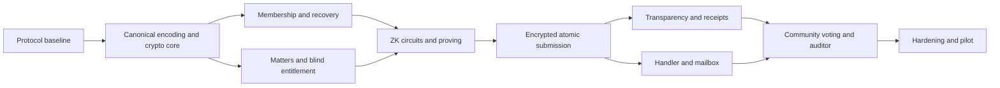

# Phased Implementation Roadmap

## 1. Delivery strategy

Build vertical security slices, not UI-first mock functionality. Each phase ends with executable tests and an explicit exit gate. Production pilots are prohibited until the external-review gate.

The critical path is:



## 2. Phase 0 - Repository and governance baseline

Deliverables:

- Accept this specification under version control.
- Create a monorepo layout for mobile, web, services, circuits, shared schemas, infrastructure, and test vectors.
- Add decision records for privacy boundary, proof statement, RSA suite, recovery, retention, and log finality.
- Define code owners so circuit/crypto/schema changes require security review.
- Configure secret scanning, signed commits/releases, dependency lockfiles, SBOM generation, and CI without production secrets.
- Build a synthetic-data policy; real NICs and complaints are forbidden in developer environments.

Exit gate: schemas and vector generator run in CI; no unresolved `TBD` changes a security statement or wire format.

## 3. Phase 1 - Canonical encoding and cryptographic core

Build first:

- Strict deterministic-CBOR encoder/decoder in the shared supported languages.
- Domain-separation and HashToField functions.
- Ed25519 signing/verification and DER-SPKI key identifiers.
- AES-256-GCM and HPKE envelope helpers with fixed suite identifiers.
- Receipt, checkpoint, lease, log-leaf, and artifact-manifest libraries.
- Cross-language conformance against `cyber-cipher-v1-vectors.json`.

Do not implement custom RSA padding, Poseidon, Ed25519, AES, HPKE, or Groth16 primitives. Wrap reviewed libraries and add protocol-level validation.

Exit gate: every language reproduces all positive vectors and rejects all negative vectors; fuzzers find no parser crash or ambiguous acceptance.

## 4. Phase 2 - Identity, membership, and recovery vertical slice

- Implement synthetic NIC registry adapter and identified enrollment flow.
- Generate/store `personAnchor`, device hash, recovery public state, and encrypted user backup.
- Implement depth-16 Poseidon tree with monotonic allocation and fixed empty leaves.
- Publish 30-second signed checkpoints and deltas.
- Implement five-minute recovery challenge and atomic old-leaf revocation/new-index allocation/recovery rotation.
- Build a client path updater and checkpoint-chain verifier.

Demo: enroll, produce current path, lose device, recover using seed, observe old leaf revoked and new leaf active after the next checkpoint.

Exit gate: recovery concurrency tests prove that at most one replacement succeeds and no index is reused.

## 5. Phase 3 - Matter registry and RSA blind entitlement

- Implement matter UUID/version lifecycle and 24-hour prepublication rule.
- Generate FIPS-compatible RSA-3072 keys with exponent 65537.
- Encrypt prototype PKCS#8 files using secret-manager KEK; prevent repository/database inclusion.
- Implement RFC 9474 randomized blind issuance and local final verification.
- Enforce one issuance fact per enrollment/matter version.
- Implement close/retire job and evidence of private-key destruction.

Demo: issue a blind entitlement, show that the IdA database cannot recognize the unblinded token, and prove a second issuance for the same matter is rejected.

Exit gate: official RFC/library test vectors pass; cross-protocol/key-reuse tests fail closed.

## 6. Phase 4 - Circuits, setup, and mobile proving

- Implement complaint and vote circuits with exact public-input order.
- Unit-test every constraint and assert constraint counts.
- Pin Circom/circomlib/build container.
- Select and verify the Powers-of-Tau transcript.
- Run three independent phase-two contributions per circuit and publish transcripts/hashes.
- Produce R1CS, WASM/native prover assets, proving keys, verification keys, and deterministic artifact manifests.
- Integrate a Rapidsnark-compatible prover on representative Android/iOS devices.

Exit gate: invalid path, wrong `P`, wrong `D`, wrong `r`, changed matter/serial/commitment/challenge, and revoked leaf all fail. Proving performance and memory fit the supported device baseline.

## 7. Phase 5 - Encrypted atomic complaint submission

- Implement evidence allowlist, size limits, client sanitization, NFC normalization, manifest, and salted commitment.
- Implement per-complaint AES-GCM and handler HPKE wrapping.
- Implement 60-second proof-session lease service.
- Build the verifier allowlist and fixed verification order.
- Implement the serializable submission transaction and idempotency behavior.
- Implement randomized deterministic-CBOR receipt generation and mobile verification.
- Add direct TLS and test-only Tor routing; disable body/network-identifier logs.

Exit gate: a successfully returned receipt always corresponds to one durable ciphertext and one durable log outbox entry; every failed transaction leaves serial/nullifier/challenge reusable.

## 8. Phase 6 - Transparency log, witnesses, and public verifier

- Implement RFC 6962-style leaf/node hashes, tree construction, inclusion and consistency proofs.
- Sign tree heads and deploy three witness implementations/configurations.
- Require 2-of-3 finality and implement tree-head gossip.
- Build a downloadable public log and open-source offline verifier.
- Implement mobile background inclusion verification and plain-language status.

Demo: show valid receipt/inclusion, mutate a leaf, present divergent heads, and withhold a witness.

Exit gate: mutation/fork proofs are rejected, one unavailable witness does not stop finality, and two unavailable/disagreeing witnesses produce a visible non-final state.

Implementation status: complete for the experimental MVP. The executable
`@cyber-cipher/transparency-log` package includes RFC 6962 construction and
proofs, operator-signed and hash-chained tree heads, three independently keyed
prototype witnesses, 2-of-3 finality with retryable pending heads, gossip fork
evidence, canonical-CBOR public download/proof responses, tenant-bound durable
storage, and offline full-log/receipt verification. Tests demonstrate mutation,
fork, and witness-outage behavior. Independent organizations and infrastructure
remain a production-readiness requirement.

## 9. Phase 7 - Handler workflow and anonymous mailbox

- Add WebAuthn staff enrollment and least-privilege authorization.
- Build case assignment, signed access events, state transitions, SLA timers, extensions, appeal, and suppression without deletion.
- Integrate handler KMS/HPKE unwrap and sandboxed evidence viewing.
- Implement signed DEK rewrap for cross-organization transfer.
- Implement complaint-specific mailbox keys, signed challenges, HPKE messages, ordering hashes, and encrypted user recovery bundle.

Exit gate: an unassigned handler cannot retrieve/decrypt a case; every allowed/denied access is attributable; transfer exposes only the DEK to authorized handler environments.

Implementation status: complete for the experimental MVP. The executable
`@cyber-cipher/handler-core` package verifies P-256 WebAuthn assertions with
RP/origin, user-verification, one-use challenge, and counter checks; applies
least-privilege assignment and lifecycle rules; signs allowed and denied access
decisions; enforces SLA, extension, appeal, and non-destructive suppression
semantics; confines DEK unwrapping to an authorized handler callback; and signs
cross-organization DEK-only rewrap records. Complaint-specific Ed25519/X25519
mailbox keys, 60-second challenges, bidirectional HPKE messages, ordering hashes,
and encrypted recovery bundles are implemented with an append-only PostgreSQL
schema. Production still requires attested authenticators, independently
administered KMS/HSM keys, and an OS-level evidence-viewing sandbox.

## 10. Phase 8 - Redaction, community voting, and auditor comparison

- Implement opt-in publication, automated PII scanning, handler draft, and independent reviewer approval.
- Publish redacted derivative provenance and commitment.
- Integrate vote circuit, current-root lease, unique vote nullifier, seven-day window, quorum 10, and 60% rule.
- Implement comparison statuses and auditor freeze/escalation workflow.
- Ensure community results never automatically close/delete a private complaint.

Exit gate: no raw attachment/plaintext enters the public store; a user cannot vote twice for one complaint, including after device replacement preserving `P`.

Implementation status: complete for the experimental MVP. The executable
`@cyber-cipher/community-core` package requires complainant opt-in, normalized
derivative-only payloads, automated PII screening, and independent reviewer
approval before publication. Commitments bind the approved payload to the
private complaint commitment and ciphertext hash. The existing Groth16 vote
circuit is integrated with signed current-root vote leases, fixed public inputs,
complaint-scoped persistent-person nullifiers, seven-day windows, quorum 10, and
the 60% support/oppose rule. Public responses expose only approved derivatives,
aggregates, and provenance. Signed auditor comparisons support justification,
freeze, escalation, and unfreeze without changing or deleting the private case.
PostgreSQL integration enforces unique nullifiers and append-only votes/events.

## 11. Phase 9 - Hardening and controlled pilot

- Complete the full test plan, privacy data inventory, DPIA-style review, and accessibility/language testing.
- Run backup/restore, key rotation, key compromise, witness outage, database failover, and recovery exercises.
- Conduct SAST, dependency, container, IaC, DAST, fuzz, load, penetration, and external cryptographic reviews.
- Resolve all critical/high findings; document accepted medium/low risks.
- Name independent witness operators and handler key custodians.
- Validate retention, appeals, moderation, and incident policies with legal/governance owners.

Exit gate: formal production-readiness sign-off. Until then, use synthetic participants and content only.

## 12. Suggested repository layout

```text
apps/
  mobile/
  handler-web/
  reviewer-web/
  community-web/
  auditor-web/
services/
  ida/
  membership/
  recovery/
  complaint-intake/
  proof-verifier/
  mailbox/
  transparency-log/
  witness/
circuits/
  complaint-membership/
  community-vote/
packages/
  protocol-cbor/
  crypto-profile/
  test-vectors/
infra/
  compose/
  production/
docs/
```

## 13. First three implementation iterations

### Iteration 1

Repository, CDDL, vector CI, key-ID/signature helpers, log hash helpers, and database migrations.

### Iteration 2

Synthetic enrollment, membership tree/checkpoint/delta publication, client path reconstruction, and recovery transaction.

### Iteration 3

Matter publication, RSA blind issuance, initial complaint circuit, and end-to-end proof verification with synthetic ciphertext.

Do not start public UI polishing before these iterations pass their security tests; wire-format or proof-statement changes after UI integration create expensive rework.

## 14. Completion definition

A feature is complete only when its protocol/schema is versioned, positive and negative tests exist, privacy-forbidden fields are tested, logs contain no sensitive values, failure is atomic, documentation matches behavior, and the acceptance matrix traces it to an SRS requirement.

## 15. Current MVP build status (2026-10-06)

The TypeScript protocol core, in-memory membership/recovery model, tenant-bound
PostgreSQL enrollment and recovery transactions, durable 30-second signed
membership checkpoint publisher, and deterministic-CBOR Identity Authority API
boundary are implemented. Client-side checkpoint-chain verification, ordered
delta application, local Poseidon-tree reconstruction, and membership-path
updates are also implemented. Durable transaction-coupled API idempotency, the
signed institutional-session adapter, and an end-to-end enrollment/recovery
PostgreSQL/API/checkpoint/client demonstration complete the Phase 2 slice.

Phase 3 is implemented. It includes RSA-3072 key validation, SHA-256
`matterKeyId`, AES-256-GCM PKCS#8 envelopes, tenant-bound PostgreSQL
publication, sequential immutable versions, the 24-hour lead-time rule, and
public lifecycle metadata. The client and IdA now complete RFC 9474
`RSABSSA-SHA384-PSS-Randomized`; issuance is transactionally limited to one
fact per enrollment/matter version without retaining blind protocol values.
The close/retire worker destroys key material before publishing a 32-byte
destruction-evidence digest. HTTP and cryptographic tests cover the complete
identified-session-to-locally-verified-token path and fail closed on key,
matter-window, and message changes. The exact pinned blind-RSA release also
passes its 98-test upstream suite, including the RFC 9474 vectors.

The Phase 4 circuit implementation and a guarded, single-operator ceremony
simulation are complete. Independent contributors, a future public beacon, and
physical mobile benchmarks remain production-readiness gates.

Phase 5 is implemented for the experimental MVP. The client-side slice provides
evidence policy enforcement, NFC normalization, deterministic manifests, salted
commitments, AES-256-GCM content encryption, and handler-specific HPKE DEK
wrapping. Tenant-bound, signed 60-second proof-session leases now enforce the
current root, expiration, single in-flight use, retry after rollback, and
consumption only after success. The tenant-bound PostgreSQL acceptance store now
locks the matter and lease, runs the RSA/ZK authorization boundary, atomically
spends the entitlement serial and complaint nullifier, records encrypted-object
metadata, writes the canonical initial-log outbox entry, signs and verifies the
randomized Ed25519 receipt, and consumes the challenge. Any failure rolls back
all effects. The anonymous deterministic-CBOR HTTP boundary now adds
transaction-coupled 24-hour idempotency, a fixed RSA-entitlement then Groth16
verification order, an artifact allowlist, native HTTPS configuration, an
explicit test-only onion transport exception, and SHA-256-addressed durable
ciphertext storage. PostgreSQL integration tests exercise success, replay,
conflict, and rollback under the CI database. Production still requires an
external cryptographic/security review and a managed object-store adapter.

One major implementation step remains for the experimental MVP:

1. Integrate the prototype clients, deploy the local/SaaS demo stack, and complete
   the MVP security and acceptance suite.

Phase 9 external review and controlled-pilot hardening remains mandatory before
any real-user or production deployment and is not counted as part of the
experimental MVP.
